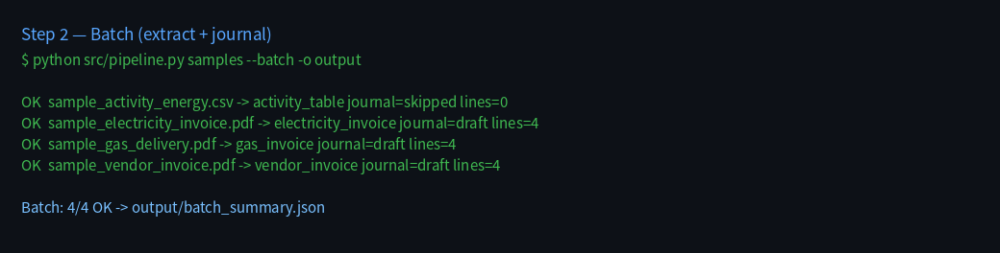
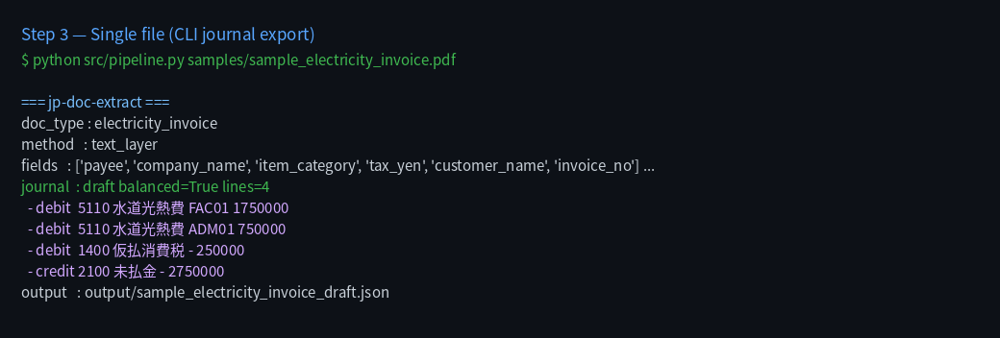
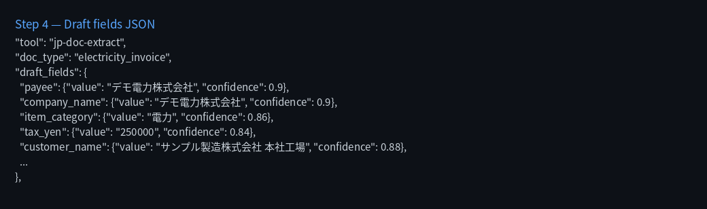
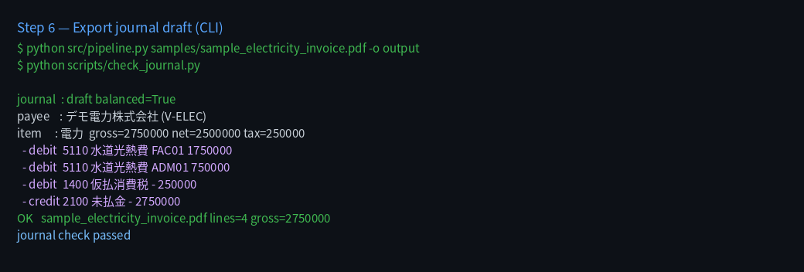
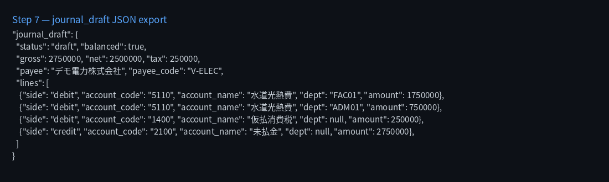

# jp-doc-extract

Public PoC: **JP documents → extract fields → rule 仕訳 (journal draft)** with evidence.

Synthetic samples only. Do not commit real invoices.

## Why this repo helps

| Gap | This PoC |
|---|---|
| Textract — no JP OCR | Text-layer + optional **PaddleOCR** / **Claude vision** |
| Extract without accounting | **Journal rules** after fields ([docs/JOURNAL.md](docs/JOURNAL.md)) |
| Need an audit trail | `evidence_history`: regex + `journal_rule` |

OCR (or PDF text) fills `draft_fields`. `rules/journal_rules.json` then builds balanced AP lines (payee, 費目, dept split, tax). HITL only — **no auto-post**.

OCR comparison: [docs/COMPARISON.md](docs/COMPARISON.md).

## Quick start

```bash
git clone https://github.com/willtran112358/jp-doc-extract.git
cd jp-doc-extract
python -m venv .venv
source .venv/bin/activate          # Windows: .\.venv\Scripts\Activate.ps1
pip install -r requirements.txt

python scripts/generate_samples.py
python src/pipeline.py samples/sample_electricity_invoice.pdf
python src/pipeline.py samples --batch -o output
python scripts/check_journal.py
```

Output: `output/*_draft.json` (`draft_fields` + `journal_draft` + `hitl`) and `output/batch_summary.json`.

## Extraction modes

| Mode | Command | When |
|---|---|---|
| **auto** (default) | `python src/pipeline.py file.pdf` | Digital PDF text layer |
| **text** | `--mode text` | No OCR fallback |
| **paddle** | `--mode paddle` | Scanned PDF (optional deps) |
| **vlm** | `--mode vlm` | Scan / messy layout (`ANTHROPIC_API_KEY`) |

```bash
pip install -r requirements-optional.txt
cp .env.example .env
python src/pipeline.py scan.pdf --mode paddle
python src/pipeline.py scan.pdf --mode vlm
```

Paddle benchmark: [docs/PADDLE_BENCHMARK.md](docs/PADDLE_BENCHMARK.md).

## Screenshots

| Step | Screenshot |
|---|---|
| Setup |  |
| Batch extract + journal |  |
| Single CLI (journal lines) |  |
| Draft fields JSON |  |
| Batch summary |  |
| Export journal draft (CLI) |  |
| `journal_draft` JSON |  |

Runbook: [docs/RUNBOOK.md](docs/RUNBOOK.md)

## Draft JSON (abbrev.)

```json
{
  "draft_fields": { "payee": { "value": "...", "confidence": 0.9 }, "amount_yen": { "value": "2750000" } },
  "journal_draft": {
    "status": "draft",
    "balanced": true,
    "lines": [{ "side": "debit", "account_code": "5110", "dept": "FAC01", "amount": 1750000 }]
  },
  "hitl": { "original": "file.pdf", "journal": "draft", "approval": null, "registered": null },
  "evidence_history": [
    { "field": "amount_yen", "source": "regex_jp" },
    { "field": "allocation", "snippet": "施設管理 70% / 総務 30%", "source": "journal_rule" }
  ]
}
```

## Layout

```text
src/pipeline.py mapper.py journal.py schema.py
rules/journal_rules.json
samples/                 # regenerate via scripts/generate_samples.py
docs/evidence/           # committed run artifacts
```

## Scope

- **In:** extract → fields → journal draft + evidence
- **Out:** GPW/SAP/Intra-mart, SSO, auto-post to GL, CRM

## License

MIT — [LICENSE](LICENSE). Samples are synthetic.
