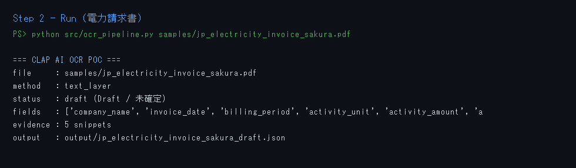
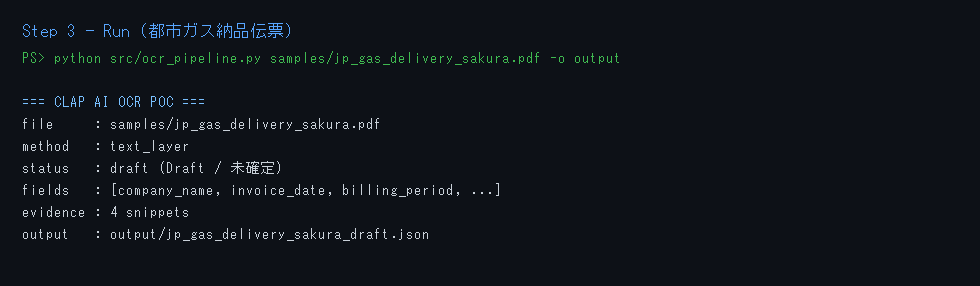

# CLAP AI OCR POC — AI Data Extraction

Short PoC: **JP sample PDF → text extract → Draft JSON** (HITL later).

| Track | Scope | This repo |
|-------|--------|-----------|
| **AI Extraction** | User upload → extract → Draft → Confirm → Core | **In scope (PoC)** |

## Quick start

```bash
cd clap-ai-ocr-poc
python -m venv .venv

# Windows PowerShell
.\.venv\Scripts\Activate.ps1
pip install -r requirements.txt

python src/ocr_pipeline.py samples/jp_electricity_invoice_sakura.pdf
python src/ocr_pipeline.py samples/jp_gas_delivery_sakura.pdf -o output
```

Output: `output/*_draft.json` — fields + evidence snippets + `status: draft`.

## Screenshots — steps & result

| Step | What | Screenshot |
|------|------|------------|
| 1 | Setup venv + install |  |
| 2 | Run electricity invoice |  |
| 3 | Run gas delivery slip |  |
| 4 | Draft JSON output |  |

## What it does / does not

- **Does:** extract text from JP PDF (text layer), regex-map invoice/GHG-ish fields, emit Draft JSON + evidence snippets.
- **Does not:** Salesforce write, Agentforce, Cloud JP OCR API, auto-save Core.

Scan-only PDFs (`method=ocr_needed`): Phase-2 — plug Azure DI / Document AI / EasyOCR (JP region).

## Samples

Client-style dummy docs (WOV2 AI sample pack):

- `samples/jp_electricity_invoice_sakura.pdf` — 電力請求書
- `samples/jp_gas_delivery_sakura.pdf` — 都市ガス納品伝票

## Layout

```text
src/ocr_pipeline.py   # extract + map → Draft JSON
samples/              # JP PDF samples
output/               # generated drafts (gitignored)
docs/screenshots/     # run step screenshots
```
