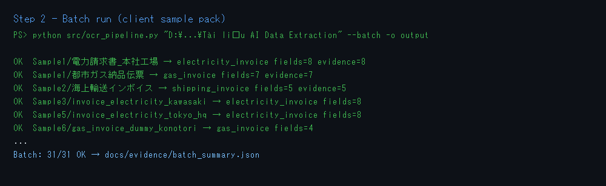
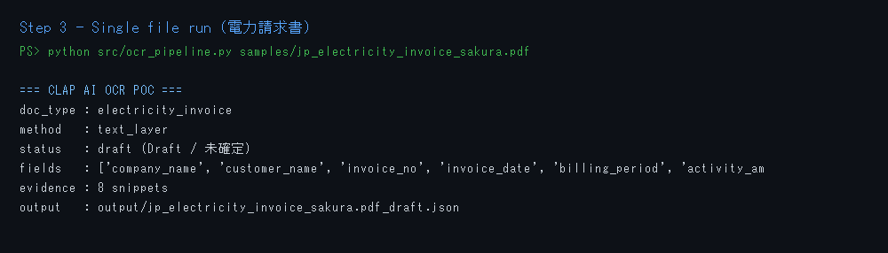
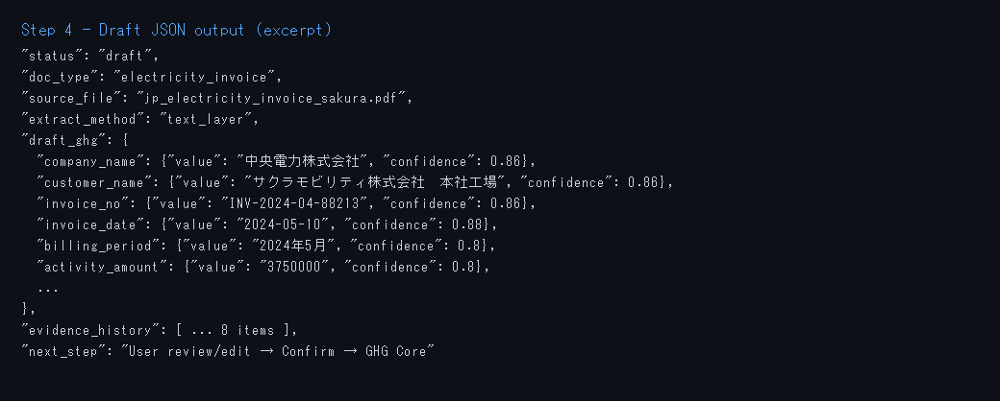
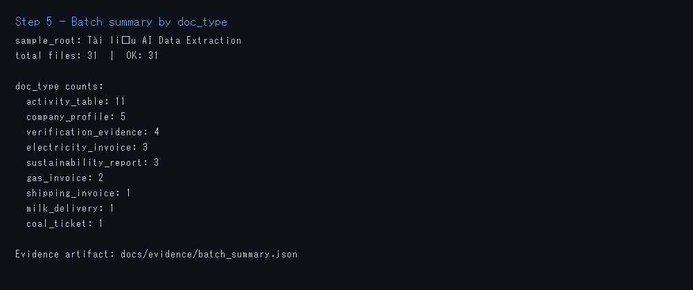

# CLAP AI OCR POC — AI Data Extraction

Short PoC: **JP client sample pack → extract → Draft JSON** (HITL later).

| Track | Scope | This repo |
|-------|--------|-----------|
| **AI Extraction** | User upload → extract → Draft → Confirm → Core | **In scope (PoC)** |

## Quick start

```bash
cd clap-ai-ocr-poc
python -m venv .venv
.\.venv\Scripts\Activate.ps1          # Windows
pip install -r requirements.txt

# single file
python src/ocr_pipeline.py samples/jp_electricity_invoice_sakura.pdf

# full client pack (PDF + CSV + XLSX)
python src/ocr_pipeline.py "D:\bchin\Downloads\VMO\WOV2-AI\Tài liệu AI Data Extraction" --batch -o output
```

Output: `output/*_draft.json` + `output/batch_summary.json`.

## Screenshots — steps & result

| Step | What | Screenshot |
|------|------|------------|
| 1 | Setup |  |
| 2 | Batch on client pack |  |
| 3 | Single invoice run |  |
| 4 | Draft JSON excerpt |  |
| 5 | Batch summary by type |  |

Latest batch evidence: [docs/evidence/batch_summary.json](docs/evidence/batch_summary.json) (**31/31 OK** on client pack).

## What it does / does not

- **Does:** PDF text-layer / CSV / XLSX → doc_type classify → field map → Draft JSON + evidence snippets.
- **Does not:** Salesforce write, Agentforce, cloud OCR API, auto-save Core.

Scan-only PDFs (`ocr_needed`): Phase-2 Azure DI / Document AI / EasyOCR (JP).

## Samples

Bundled:

- `samples/jp_electricity_invoice_sakura.pdf`
- `samples/jp_gas_delivery_sakura.pdf`

Full client pack (local path used in batch): `Tài liệu AI Data Extraction` (Samples 1–6).

## Layout

```text
src/ocr_pipeline.py      # extract + map + --batch
samples/                 # bundled JP PDFs
docs/screenshots/        # run evidence
docs/evidence/           # batch_summary + sample drafts
output/                  # generated (gitignored)
```
